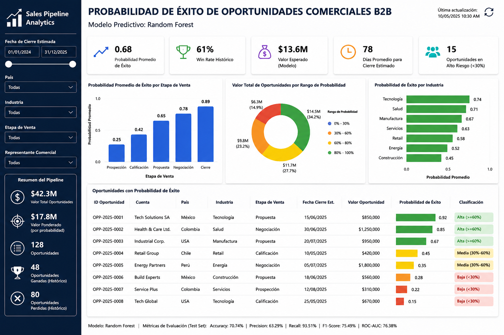

# Despliegue de Modelos

## Infraestructura

### Nombre del modelo

**Modelo Predictivo de Éxito de Oportunidades Comerciales B2B – Random Forest**

### Plataforma de despliegue

**Microsoft Power BI Desktop**

El modelo de Machine Learning será integrado en un dashboard interactivo de Power BI con el objetivo de visualizar la probabilidad de éxito de las oportunidades comerciales y apoyar la toma de decisiones de los equipos de ventas y desarrollo de negocio.

### Requisitos técnicos

* Python 3.11
* Microsoft Power BI Desktop
* Pandas
* NumPy
* Scikit-Learn
* Joblib
* Modelo Random Forest entrenado (.pkl)

### Requisitos de seguridad

* Acceso restringido al archivo Power BI.
* Protección de la información comercial utilizada para el entrenamiento del modelo.
* Almacenamiento seguro del modelo entrenado y de las bases de datos utilizadas.
* Control de acceso a los reportes mediante permisos de usuario.

### Diagrama de arquitectura

```text
Datos Históricos del Pipeline Comercial
                    │
                    ▼
          Preparación de Datos
                    │
                    ▼
      Modelo Random Forest Entrenado
                    │
                    ▼
      Generación de Probabilidades
                    │
                    ▼
            Dashboard Power BI
                    │
                    ▼
      Usuarios Comerciales y Gerenciales
```

---

## Código de despliegue

Debido al alcance académico del proyecto, no se implementó una aplicación productiva. Sin embargo, se diseñó un flujo de inferencia que describe cómo el modelo Random Forest podría integrarse en un entorno de análisis y visualización mediante Power BI.

### Flujo de Inferencia del Modelo

El proceso de inferencia propuesto para el modelo Random Forest se compone de las siguientes etapas:

1. Carga de la información histórica y de nuevas oportunidades comerciales.
2. Aplicación de las transformaciones de datos utilizadas durante el entrenamiento del modelo.
3. Ejecución del modelo Random Forest entrenado para estimar la probabilidad de éxito de cada oportunidad.
4. Generación de un conjunto de datos con las probabilidades obtenidas.
5. Visualización de los resultados mediante un dashboard en Power BI.

```text
Datos de Oportunidades
          │
          ▼
Preprocesamiento
          │
          ▼
Modelo Random Forest
          │
          ▼
Probabilidad de Éxito
          │
          ▼
Power BI Dashboard
```

### Rutas de acceso a los archivos

```text
/data/sales_pipeline.csv

/models/random_forest_model.pkl

/reports/Sales_Pipeline_B2B.pbix
```

### Variables de entorno

No se requieren variables de entorno para este proyecto académico.

---

## Documentación del despliegue

### Instrucciones de instalación

1. Instalar Python 3.11.
2. Instalar las librerías necesarias para la ejecución del modelo.
3. Instalar Microsoft Power BI Desktop.
4. Descargar los archivos del proyecto.
5. Abrir el archivo `Sales_Pipeline_B2B.pbix`.

### Instrucciones de configuración

1. Verificar las rutas de acceso a los datos.
2. Cargar el modelo Random Forest entrenado.
3. Actualizar las conexiones de datos en Power BI.
4. Validar que las predicciones se visualicen correctamente en el dashboard.

### Instrucciones de uso

1. Actualizar la información del pipeline comercial.
2. Refrescar el dashboard de Power BI.
3. Consultar la probabilidad de éxito estimada para cada oportunidad comercial.
4. Utilizar los resultados para apoyar la priorización de oportunidades y la asignación de recursos comerciales.

### Instrucciones de mantenimiento

* Actualizar periódicamente la base de datos con nuevas oportunidades comerciales.
* Reentrenar el modelo utilizando información más reciente.
* Monitorear las métricas Accuracy, Precision, Recall, F1-Score y ROC-AUC para validar el desempeño del modelo.
* Actualizar el dashboard cuando se incorporen nuevas variables o mejoras al modelo.

---

## Costos de Infraestructura

Para fines académicos, la solución propuesta utiliza herramientas de libre acceso o disponibles mediante licenciamiento institucional, por lo que no se generan costos adicionales de infraestructura.

En un entorno empresarial, el despliegue podría realizarse mediante Power BI Service y almacenamiento corporativo, cuyos costos dependerían de las licencias y recursos contratados por la organización.

---

## Beneficios Esperados del Despliegue

La integración del modelo en Power BI permitirá:

* Priorizar oportunidades con mayor probabilidad de cierre exitoso.
* Optimizar el esfuerzo comercial de los equipos de ventas.
* Apoyar la toma de decisiones basada en datos.
* Incrementar la eficiencia en la gestión del pipeline comercial.
* Facilitar el seguimiento y monitoreo de oportunidades comerciales mediante visualizaciones interactivas.

---

# Visualización Propuesta en Power BI

Como parte de la propuesta de despliegue, se diseñó un dashboard conceptual que permite visualizar las probabilidades de éxito generadas por el modelo Random Forest, así como indicadores clave del pipeline comercial.

### Características principales

* Probabilidad de éxito por oportunidad.
* Win Rate histórico.
* Valor esperado del pipeline.
* Distribución de oportunidades por industria.
* Distribución de oportunidades por etapa comercial.
* Identificación de oportunidades de alto riesgo.



*Figura 1. Propuesta conceptual de dashboard para la visualización de predicciones del modelo Random Forest en Power BI.*
